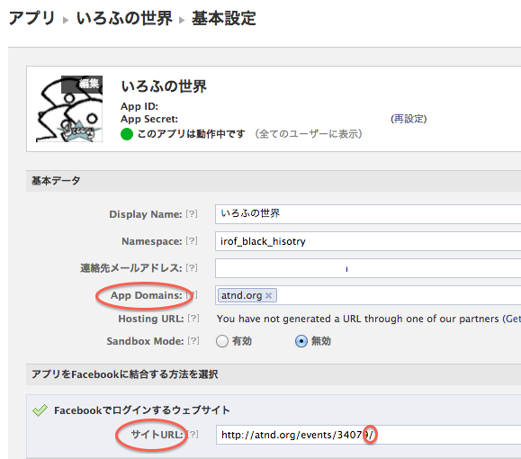
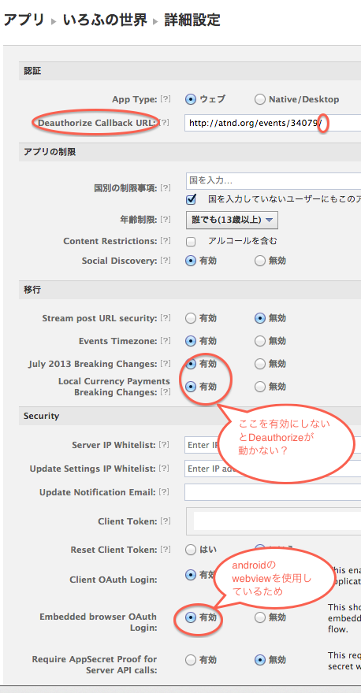

開発環境の構築

- android sdk のセットアップ
 - android update sdk
 - target:16(4.1)を入れてください
- antの設定
 - eclipse3.7系以降
 - eclipse3.6
 - コマンドライン
 
------
emuratorで動かす場合の設定

 - [爆速エミュレータの設定](http://dev.classmethod.jp/smartphone/build-fast-android-emulator/)
  - Lionまで。MountanLionだとエラーになるようです
  
 - TTSをならす設定
 　- エミュレーターの起動オプションに「--useaudio」を追加
 　- [n2tts](https://play.google.com/store/apps/details?id=jp.kddilabs.n2tts)のインストール
 
 - N2TTS
  - 対応端末にinstall後、adb pullで取得、adb pushでinstallしてください

------
SNSキーの取得

 - setting/ad_key_mst.xml => res/values/ad_key.xmlをコピー作成してください(.gitignoreには上がらない設定になっています)


------
各種キーの取得

 - nakamapのキーを取得してください
  - http://developer.nakamap.com/
  - nakamap自体のユーザ登録が必要です（別途公式アプリ等が必要かも）
  - CreateAppで作成した瞬間にemail認証が飛びますが、Gmail等では迷惑メールになるようです。
  - 直ぐ認証しない場合は、あとから再認証できませんので早急の確認を御願いします
  
 - adMobのキーを取得してください
  - 現在、irofさんのサイト向けに、自社広告の設定をしています
  - [自社広告の設定](http://support.google.com/admob/bin/answer.py?hl=ja&answer=1619751&topic=1619748&ctx=topic)

 - Facebookのキーを取得してください
  - https://github.com/kimukou/facebook4j-android-example  



なイメージで設定します
  
------
build.xmlが作成済みの場合に、antを通すための修正

- 各フォルダのlocal.properties
 - sdk.dir=XXXXX
 - を自分の環境にあった形に修正
 
------
ライブラリプロジェクト追加後の build.xmlの生成(同梱済ですので操作はいらないかも。参考情報)

- ライブラリプロジェクト  
```
android update project -p ./  
```
- メインプロジェクト  
```
android update project -p ./ -l ../NakamapSDK  
```
- テストプロジェクト  
```
android update test-project -m ../irof_history -p ./   
```

なイメージになります

------
署名キーの作成の仕方

- irof_history/createSignkey.sh を実行してください

```
keytool -genkey -v -keyalg RSA -keystore ./irof.keystore -alias irofworld -validity 10000

姓名を入力してください。
  [Unknown]:  irof_history
組織単位名を入力してください。
  [Unknown]:  irof
組織名を入力してください。
  [Unknown]:  irof_world
都市名または地域名を入力してください。
  [Unknown]:  irof_brack_world
州名または地方名を入力してください。
  [Unknown]:  irof_cloud
この単位に該当する 2 文字の国番号を入力してください。
  [Unknown]:  JP
CN=irof_history, OU=irof, O=irof_world, L=irof_brack_world, ST=irof_cloud, C=JP でよろしいですか?
  [いいえ]:  はい

10,000 日間有効な 1,024 ビットの RSA の鍵ペアと自己署名型証明書 (SHA1withRSA) を生成しています
    ディレクトリ名: CN=irof_history, OU=irof, O=irof_world, L=irof_brack_world, ST=irof_cloud, C=JP
<irofworld> の鍵パスワードを入力してください。
    (キーストアのパスワードと同じ場合は RETURN を押してください):  
新規パスワードを再入力してください: irof_friend
[./key を格納中]
```

のような形で作成します

- irof_history/local.properties を編集します。上記の場合は

```
key.alias=irofworld
key.store.password=irof_friend
key.alias.password=irof_friend
```

となります